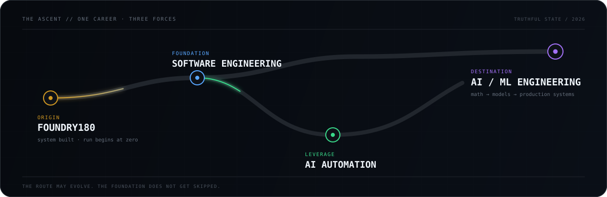

  

  <strong>Building an engineering career from first principles.</strong> 
  Software Engineering at the foundation · AI/ML Engineering as the destination · AI Automation as leverage

## The origin

  

**Foundry180** is the beginning: a private, self-guided 180-unit software engineering academy built around Python, reasoning, debugging, testing, Git, projects, and independent engineering.

The system is built. The personal run begins honestly at **zero**.

## Career systems

| System | Purpose | State |
|:--|:--|:--|
| **Foundry180** | Software foundations, independent problem-solving, production habits | Private system · learner state 0/180 |
| [AI/ML Engineering Academy](https://github.com/adhamcodes/AI-ML-Engineering-Academy) | Mathematics → ML → deep learning → LLM systems → MLOps | Public curriculum |
| [AI Automation Engineering Academy](https://github.com/adhamcodes/AI-Automation-Engineering-Academy) | APIs, workflows, Python, agents, reliability, operations | Public curriculum |

## Build orbit

  

  <a href="https://zeroupload.app"><b>ZeroUpload ↗</b></a>
  &nbsp;·&nbsp;
  <a href="https://github.com/adhamcodes/copykit"><b>CopyKit</b></a>
  &nbsp;·&nbsp;
  <a href="https://github.com/adhamcodes/SponsorSniper"><b>SponsorSniper</b></a>
  &nbsp;·&nbsp;
  <a href="https://github.com/adhamcodes/git-github-course"><b>Git &amp; GitHub Academy</b></a>
  &nbsp;·&nbsp;
  <a href="https://github.com/adhamcodes/My-Portfolio"><b>Master 2.0</b></a>

<b>Operating doctrine</b>

 

`understanding > copying` · `reliability > demos` · `building > consuming` · `fundamentals > hype`

I build across categories because making things is the practice. The career direction stays deliberate: become strong at software engineering, use automation as a force multiplier, and grow toward AI/ML systems that survive outside a notebook.

---

  <a href="https://portfolio-adham-mu.vercel.app"><b>ENTER THE PORTFOLIO ↗</b></a>
  &nbsp;&nbsp;·&nbsp;&nbsp;
  <a href="https://github.com/adhamcodes?tab=repositories"><b>EXPLORE ALL BUILDS ↗</b></a>

<code>current frame: foundation first / systems always</code>

