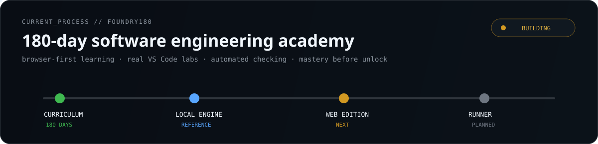
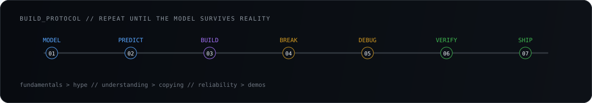
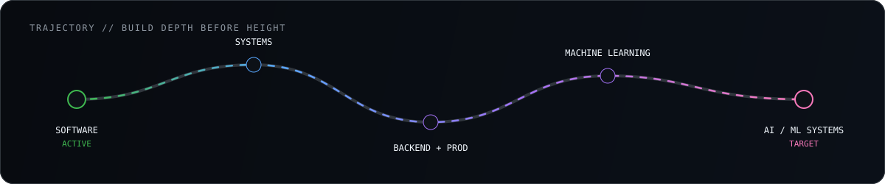

<p align="center">
  
</p>

<p align="center">
  <code>Python</code> · <code>Software Engineering</code> · <code>Git</code> · <code>Systems</code> · <code>Backend</code> · <code>ML Foundations</code>
</p>

<p align="center">
  <sub>Building the foundation first. Shipping evidence as I go.</sub>
</p>

### `> CURRENT_PROCESS`

<p align="center">
  
</p>

### `> SELECTED_PROOF`

<p align="center">
  
</p>

<p align="center">
  <a href="https://github.com/adhamcodes/ZeroUpload"><b>ZeroUpload</b></a> ·
  <a href="https://github.com/adhamcodes/AI-ML-Engineering-Academy"><b>AI/ML Engineering Academy</b></a> ·
  <a href="https://github.com/adhamcodes/AI-Automation-Engineering-Academy"><b>AI Automation Academy</b></a> ·
  <a href="https://github.com/adhamcodes/git-github-course"><b>Git & GitHub Course</b></a>
</p>

### `> BUILD_PROTOCOL`

<p align="center">
  
</p>

### `> TRAJECTORY`

<p align="center">
  
</p>

<details>
<summary><b>read the operator notes</b></summary>
<br/>

I’m deliberately building from first principles instead of collecting frameworks.

The goal is to become the kind of engineer who can enter an unfamiliar system, form a correct mental model, make sound trade-offs, build something useful, debug it from evidence, and improve it without depending on a tutorial.

```text
fundamentals > hype
understanding > copying
build > consume
reliability > demos
```

Long-term direction: **AI/ML engineering and increasingly capable intelligent systems.**

</details>

<p align="center">
  <sub>BUILD_IN_PUBLIC=1 · FAKE_TITLES=0 · SHORTCUT_STACK=0</sub>
</p>