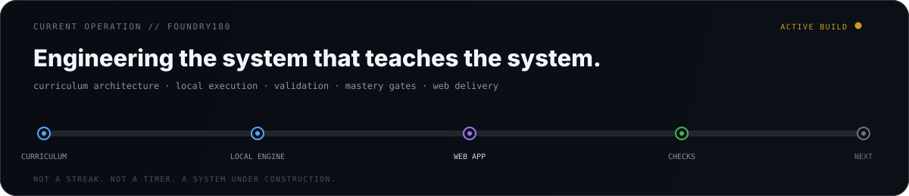
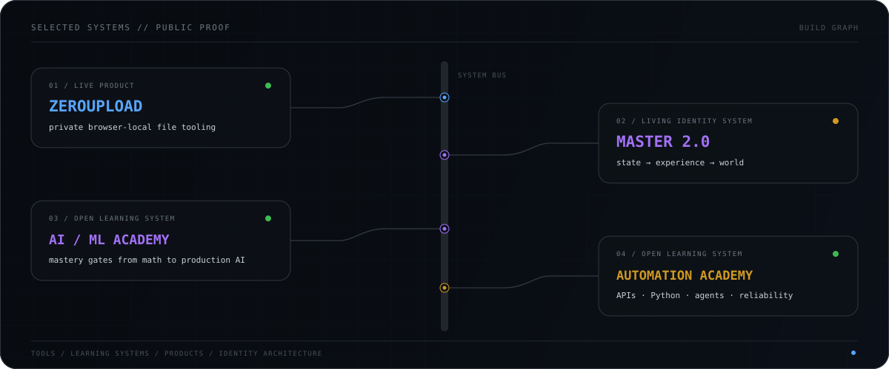

  

  <code>Python</code> · <code>Software Engineering</code> · <code>Systems</code> · <code>Backend</code> · <code>Git</code> · <code>AI / ML</code>

  Building from first principles. Shipping tools, breaking things, debugging from evidence, and understanding what survives.

## Current operation

  

  <code>learn → predict → build → break → inspect → debug → prove → ship</code>

## Selected systems

  

  <a href="https://github.com/adhamcodes/ZeroUpload"><b>ZeroUpload</b></a>
  &nbsp;·&nbsp;
  <a href="https://github.com/adhamcodes/My-Portfolio"><b>Master 2.0</b></a>
  &nbsp;·&nbsp;
  <a href="https://github.com/adhamcodes/AI-ML-Engineering-Academy"><b>AI/ML Engineering Academy</b></a>
  &nbsp;·&nbsp;
  <a href="https://github.com/adhamcodes/AI-Automation-Engineering-Academy"><b>Automation Academy</b></a>

  
    Also building and preserving smaller systems:
    <a href="https://github.com/adhamcodes/git-github-course">Git & GitHub — Zero to Independent</a>
    ·
    <a href="https://github.com/adhamcodes/SponsorSniper">SponsorSniper</a>
  

## How I work

  

<b>direction</b>

 

I’m deliberately building the engineering foundation before collecting labels or frameworks.

The target is to become the kind of engineer who can enter an unfamiliar system, understand its constraints, make sound trade-offs, build something useful, debug it from evidence, and keep improving it after the demo is over.

Long term: **software engineering → AI/ML engineering → increasingly capable intelligent systems.**

---

  <a href="https://zeroupload.app"><b>ZEROUPLOAD ↗</b></a>
  &nbsp;&nbsp;·&nbsp;&nbsp;
  <a href="https://portfolio-adham-mu.vercel.app"><b>PORTFOLIO ↗</b></a>

  <code>status: still building</code>

