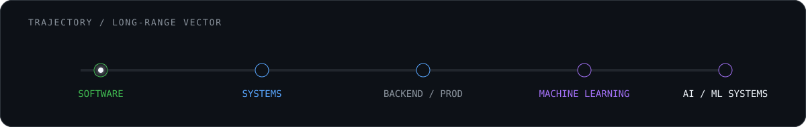

<p align="center">
  
</p>

<p align="center">
  <code>Python</code> · <code>Software Engineering</code> · <code>Git</code> · <code>Systems</code> · <code>Backend</code> · <code>ML Foundations</code>
</p>

### `> CURRENT_PROCESS`

<p align="center">
  
</p>

```text
learn → predict → build → break → debug → prove → advance
```

### `> SYSTEMS_SHIPPED`

<table>
<tr>
<td width="50%" valign="top">

#### [ZeroUpload](https://github.com/adhamcodes/ZeroUpload)
Privacy-first browser file tooling. Processing stays on-device instead of uploading files to a server.

`TypeScript` `Browser APIs` `Privacy`

</td>
<td width="50%" valign="top">

#### [AI/ML Engineering Academy](https://github.com/adhamcodes/AI-ML-Engineering-Academy)
A mastery-based learning system spanning mathematics, classical ML, deep learning, LLMs, agents, MLOps and system design.

`ML` `Deep Learning` `LLMs` `MLOps`

</td>
</tr>
<tr>
<td width="50%" valign="top">

#### [AI Automation Engineering Academy](https://github.com/adhamcodes/AI-Automation-Engineering-Academy)
A build-first curriculum for APIs, workflows, Python automation, AI systems, reliability and commercial engineering.

`Python` `APIs` `Automation` `Agents`

</td>
<td width="50%" valign="top">

#### [Git & GitHub — Zero to Independent](https://github.com/adhamcodes/git-github-course)
A practical Git/GitHub course built around prediction, inspection, break/recover drills and real collaboration workflows.

`Git` `GitHub` `Recovery` `Collaboration`

</td>
</tr>
</table>

### `> BUILD_PROTOCOL`

```text
01  learn the model
02  predict before running
03  build without hiding behind tutorials
04  break the system on purpose
05  debug from evidence
06  explain what happened
07  ship what survives
```

> `fundamentals > hype` · `understanding > copying` · `build > consume` · `reliability > demos`

### `> TRAJECTORY`

<p align="center">
  
</p>

<p align="center">
  <sub>STATUS: BUILDING · LEARNING IN PUBLIC · NO FAKE TITLES · NO FAKE METRICS</sub>
</p>
