<p align="center">
  
</p>

<p align="center">
  <b>Building systems from first principles.</b><br/>
  <sub>Shipping tools · breaking things · fixing them · documenting the climb</sub>
</p>

<p align="center">
  <code>Python</code> · <code>Software Engineering</code> · <code>Git</code> · <code>Systems</code> · <code>Backend</code> · <code>ML Foundations</code>
</p>

---

### `> CURRENT_MISSION`

<p align="center">
  
</p>

```text
learn → predict → build → debug → prove → advance
```

---

### `> SYSTEMS_SHIPPED`

<table>
<tr>
<td width="50%" valign="top">

#### [ZeroUpload](https://github.com/adhamcodes/ZeroUpload)
Privacy-first browser file tooling. Processing stays on-device instead of uploading to a server.

`TypeScript` `Browser APIs` `Privacy`

</td>
<td width="50%" valign="top">

#### [AI/ML Engineering Academy](https://github.com/adhamcodes/AI-ML-Engineering-Academy)
A mastery-based learning system spanning mathematics, classical ML, deep learning, LLMs, agents, MLOps and system design.

`ML` `Deep Learning` `LLMs` `MLOps`

</td>
</tr>
<tr>
<td width="50%" valign="top">

#### [AI Automation Engineering Academy](https://github.com/adhamcodes/AI-Automation-Engineering-Academy)
A build-first curriculum for APIs, workflows, Python automation, AI systems, reliability and commercial engineering.

`Python` `APIs` `Automation` `Agents`

</td>
<td width="50%" valign="top">

#### [Git & GitHub — Zero to Independent](https://github.com/adhamcodes/git-github-course)
A practical Git/GitHub course built around prediction, inspection, break/recover drills and real collaboration workflows.

`Git` `GitHub` `Recovery` `Collaboration`

</td>
</tr>
</table>

---

### `> BUILD_PHILOSOPHY`

```text
fundamentals > hype
understanding > copying
build > consume
reliability > demos
```

I’m deliberately starting from the foundation rather than collecting frameworks.

The target is to become the kind of engineer who can enter an unfamiliar system, understand it, make sound trade-offs, build something useful, debug it when it breaks, and improve it from there.

---

### `> TRAJECTORY`

```text
software engineering
        ↓
computer systems
        ↓
backend + production engineering
        ↓
machine learning
        ↓
AI/ML systems
```

<p align="center">
  <sub>status: building · learning in public · no fake titles</sub>
</p>
