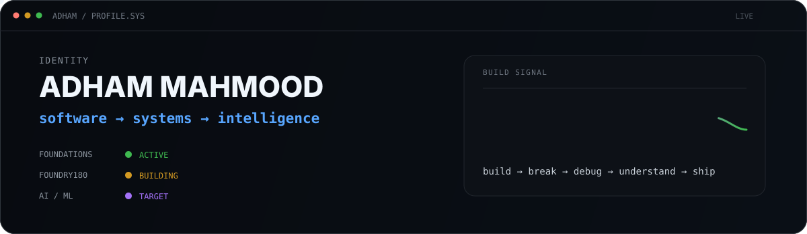
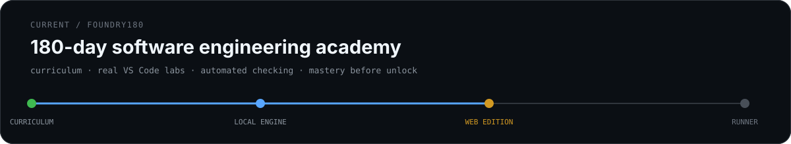

  

  <code>Python</code> · <code>Software Engineering</code> · <code>Git</code> · <code>Systems</code> · <code>Backend</code> · <code>ML Foundations</code>

  Building systems from first principles. Shipping tools, breaking things, fixing them.

## Current

  

  <code>learn → predict → build → break → debug → prove → ship</code>

## Selected work

  

  <a href="https://github.com/adhamcodes/ZeroUpload"><b>ZeroUpload</b></a> ·
  <a href="https://github.com/adhamcodes/AI-ML-Engineering-Academy"><b>AI/ML Engineering Academy</b></a> ·
  <a href="https://github.com/adhamcodes/AI-Automation-Engineering-Academy"><b>AI Automation Academy</b></a> ·
  <a href="https://github.com/adhamcodes/git-github-course"><b>Git & GitHub — Zero to Independent</b></a>

---

  <code>fundamentals &gt; hype</code> ·
  <code>understanding &gt; copying</code> ·
  <code>build &gt; consume</code> ·
  <code>reliability &gt; demos</code>

<b>direction</b>

 

I’m deliberately building the engineering foundation first instead of collecting frameworks.

The target is simple: become the kind of engineer who can enter an unfamiliar system, understand it, make sound trade-offs, build something useful, debug it from evidence, and keep improving from there.

Long term: **AI/ML engineering and increasingly capable intelligent systems.**

